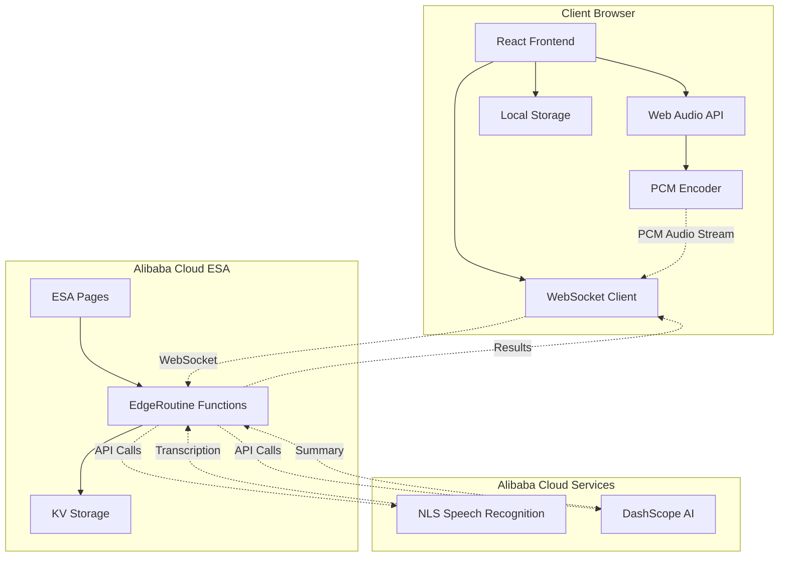

# Design Document

## Overview

MeetingMind is a real-time meeting transcription and AI summarization application built with React 18, TypeScript, and TailwindCSS. The system leverages Alibaba Cloud's Edge Security Acceleration (ESA) platform to provide low-latency speech recognition and AI-powered summarization through EdgeRoutine functions.

The architecture follows a client-server model where the React frontend captures audio, establishes WebSocket connections to EdgeRoutine functions, and displays real-time transcriptions and AI-generated summaries. All API credentials are managed client-side for security and flexibility.

## Architecture

### System Architecture Diagram



### Data Flow

1. **Audio Capture**: Web Audio API captures microphone input and converts to PCM format
2. **Real-time Transmission**: WebSocket streams PCM data to EdgeRoutine with minimal latency
3. **Speech Recognition**: EdgeRoutine forwards audio to Alibaba Cloud NLS using user-provided tokens
4. **Transcription Display**: Real-time text results are sent back and displayed with timestamps
5. **AI Summarization**: Accumulated transcripts are sent to DashScope for intelligent summarization
6. **Session Persistence**: Transcripts and summaries are cached in ESA KV storage for later retrieval

## Components and Interfaces

### Frontend Components

#### MeetingPanel Component
```typescript
interface MeetingPanelProps {
  sessionId: string;
  onSessionChange: (sessionId: string) => void;
}

interface MeetingPanelState {
  isRecording: boolean;
  transcript: TranscriptEntry[];
  summary: string;
  recordingDuration: number;
}
```

**Responsibilities:**
- Orchestrates the main meeting interface
- Manages recording state and session lifecycle
- Coordinates between transcript and summary displays

#### AudioCapture Hook
```typescript
interface AudioCaptureConfig {
  sampleRate: number;
  channels: number;
  bufferSize: number;
}

interface AudioCaptureHook {
  startRecording: () => Promise<void>;
  stopRecording: () => void;
  isRecording: boolean;
  audioLevel: number;
  error: string | null;
}
```

**Responsibilities:**
- Manages microphone access and permissions
- Converts audio to PCM format in real-time
- Provides audio level monitoring for UI feedback

#### WebSocket Communication Hook
```typescript
interface WebSocketConfig {
  url: string;
  protocols?: string[];
  reconnectAttempts: number;
  reconnectDelay: number;
}

interface WebSocketHook {
  connect: () => void;
  disconnect: () => void;
  sendAudio: (pcmData: ArrayBuffer) => void;
  connectionState: 'connecting' | 'connected' | 'disconnected' | 'error';
  lastMessage: WebSocketMessage | null;
}
```

**Responsibilities:**
- Establishes and maintains WebSocket connection to EdgeRoutine
- Handles automatic reconnection with exponential backoff
- Manages binary audio data transmission and text message reception

#### API Configuration Manager
```typescript
interface ApiCredentials {
  nlsToken: string;
  dashScopeKey: string;
}

interface ApiConfigHook {
  credentials: ApiCredentials | null;
  saveCredentials: (creds: ApiCredentials) => void;
  testConnection: () => Promise<boolean>;
  isValid: boolean;
}
```

**Responsibilities:**
- Securely stores API credentials in localStorage
- Validates credentials against Alibaba Cloud services
- Provides credential management interface

### Backend EdgeRoutine Functions

#### WebSocket Handler
```typescript
interface WebSocketHandler {
  onConnect: (websocket: WebSocket) => void;
  onMessage: (websocket: WebSocket, message: ArrayBuffer | string) => void;
  onClose: (websocket: WebSocket) => void;
  onError: (websocket: WebSocket, error: Error) => void;
}
```

**Responsibilities:**
- Manages WebSocket connections from multiple clients
- Routes audio data to appropriate speech recognition services
- Handles connection lifecycle and error recovery

#### Speech Recognition Proxy
```typescript
interface SpeechRecognitionProxy {
  processAudio: (audioData: ArrayBuffer, token: string) => Promise<TranscriptResult>;
  handleStream: (audioStream: ReadableStream, token: string) => AsyncGenerator<TranscriptResult>;
}

interface TranscriptResult {
  text: string;
  isFinal: boolean;
  confidence: number;
  timestamp: number;
}
```

**Responsibilities:**
- Proxies audio data to Alibaba Cloud NLS
- Handles streaming recognition results
- Manages rate limiting and error handling

#### AI Summarization Service
```typescript
interface SummarizationService {
  generateSummary: (transcript: string, apiKey: string) => Promise<SummaryResult>;
  updateSummary: (existingSummary: string, newTranscript: string, apiKey: string) => Promise<SummaryResult>;
}

interface SummaryResult {
  summary: string;
  keyPoints: string[];
  confidence: number;
  processingTime: number;
}
```

**Responsibilities:**
- Integrates with DashScope for AI-powered summarization
- Handles incremental summary updates
- Manages API rate limiting and fallback strategies

## Data Models

### Core Data Structures

#### TranscriptEntry
```typescript
interface TranscriptEntry {
  id: string;
  text: string;
  timestamp: number;
  isFinal: boolean;
  confidence: number;
  speaker?: string;
  language: string;
}
```

#### MeetingSession
```typescript
interface MeetingSession {
  id: string;
  title: string;
  startTime: number;
  endTime?: number;
  transcript: TranscriptEntry[];
  summary: string;
  language: string;
  participants: string[];
  metadata: SessionMetadata;
}

interface SessionMetadata {
  duration: number;
  wordCount: number;
  averageConfidence: number;
  exportFormats: string[];
}
```

#### WebSocketMessage
```typescript
type WebSocketMessage = 
  | AudioMessage
  | TranscriptMessage
  | SummaryMessage
  | ErrorMessage
  | StatusMessage;

interface AudioMessage {
  type: 'audio';
  data: ArrayBuffer;
  sessionId: string;
  timestamp: number;
}

interface TranscriptMessage {
  type: 'transcript';
  entry: TranscriptEntry;
  sessionId: string;
}

interface SummaryMessage {
  type: 'summary';
  summary: string;
  keyPoints: string[];
  sessionId: string;
}
```

### Storage Schema

#### Local Storage Structure
```typescript
interface LocalStorageSchema {
  'meetingmind.credentials': ApiCredentials;
  'meetingmind.sessions': string[]; // Session IDs
  'meetingmind.settings': UserSettings;
  'meetingmind.cache': CacheData;
}

interface UserSettings {
  theme: 'light' | 'dark';
  language: string;
  autoSummary: boolean;
  exportFormat: 'json' | 'txt' | 'pdf';
  audioQuality: 'low' | 'medium' | 'high';
}
```

#### ESA KV Storage Schema
```typescript
interface KVStorageSchema {
  [`session:${sessionId}`]: MeetingSession;
  [`transcript:${sessionId}`]: TranscriptEntry[];
  [`summary:${sessionId}`]: SummaryResult;
  [`user:${userId}:sessions`]: string[];
}
```

## Correctness Properties

*A property is a characteristic or behavior that should hold true across all valid executions of a system—essentially, a formal statement about what the system should do. Properties serve as the bridge between human-readable specifications and machine-verifiable correctness guarantees.*

After analyzing the acceptance criteria, I've identified the following properties that can be validated through property-based testing. These properties ensure the system behaves correctly across all valid inputs and scenarios.

### Property Reflection

Before defining the final properties, I reviewed all testable criteria from the prework analysis to eliminate redundancy:

- **Credential Management**: Properties 1.2, 1.3, and 1.4 can be combined into comprehensive credential handling properties
- **Audio Processing**: Properties 2.3, 2.4, and 3.1 form a complete audio pipeline that can be tested as integrated properties
- **UI State Management**: Properties 2.5, 3.4, 4.5, and 9.5 all test UI state updates and can be consolidated
- **Data Persistence**: Properties 5.2, 5.4, and 5.5 test storage operations that can be unified
- **Error Handling**: Properties 3.5, 4.4, 8.5, and 10.1-10.5 test various error scenarios that share common patterns

### Core Properties

**Property 1: Credential Storage Round-trip**
*For any* valid API credentials (NLS Token and DashScope API Key), storing them in local storage and then retrieving them should return identical credential values.
**Validates: Requirements 1.2**

**Property 2: Credential Validation Consistency**
*For any* set of API credentials, validation should consistently return the same result when tested multiple times with the same credentials.
**Validates: Requirements 1.3, 1.4**

**Property 3: Audio PCM Encoding Preservation**
*For any* audio input captured from the microphone, encoding to PCM format should preserve the essential audio characteristics (sample rate, bit depth, channel count).
**Validates: Requirements 2.3**

**Property 4: WebSocket Audio Transmission Integrity**
*For any* PCM audio data, sending it through WebSocket and receiving it on the server side should preserve the binary data integrity without corruption.
**Validates: Requirements 2.4, 8.3**

**Property 5: Transcription Result Processing**
*For any* transcription result from NLS, the system should correctly classify it as intermediate or final and display it with proper timestamp formatting.
**Validates: Requirements 3.2, 3.3**

**Property 6: Session ID Uniqueness**
*For any* sequence of new session creations, each generated session ID should be unique across all sessions.
**Validates: Requirements 5.1**

**Property 7: Session Data Persistence Round-trip**
*For any* meeting session with transcript and summary data, storing it in ESA KV storage and then retrieving it should return equivalent session data.
**Validates: Requirements 5.2, 5.4**

**Property 8: Session Deletion Completeness**
*For any* session that exists in storage, deleting it should remove all associated data (transcript, summary, metadata) and the session should no longer be retrievable.
**Validates: Requirements 5.5**

**Property 9: Translation Language Consistency**
*For any* Chinese text input, when translation is enabled for a specific target language (English, Japanese, Korean), all translation results should be in the correct target language.
**Validates: Requirements 6.1, 6.2**

**Property 10: Export Format Integrity**
*For any* session data, exporting to different formats (JSON, TXT, PDF) should preserve all essential information (transcript text, timestamps, summary) in the appropriate format structure.
**Validates: Requirements 7.2, 7.3, 7.4**

**Property 11: WebSocket Reconnection Backoff**
*For any* WebSocket connection failure, the reconnection attempts should follow exponential backoff timing (each retry should wait longer than the previous one).
**Validates: Requirements 8.2**

**Property 12: UI Responsiveness**
*For any* user interaction (clicks, input changes, state transitions), the system should provide visual feedback within a reasonable time threshold.
**Validates: Requirements 9.2, 9.5**

**Property 13: Responsive Layout Adaptation**
*For any* screen size change or window resize, the interface should maintain proper layout proportions and element visibility.
**Validates: Requirements 9.3**

**Property 14: Theme Switching Data Preservation**
*For any* active session with transcript and summary data, switching between light and dark themes should preserve all session data without loss.
**Validates: Requirements 9.4**

**Property 15: Error Recovery Data Preservation**
*For any* critical error that occurs during active recording, the system should preserve existing transcript data and provide recovery options without data loss.
**Validates: Requirements 10.5**

## Error Handling

### Error Categories and Strategies

#### Network and Connectivity Errors
- **WebSocket Connection Failures**: Implement exponential backoff reconnection with maximum retry limits
- **API Service Unavailability**: Provide graceful degradation and user notification
- **Rate Limiting**: Queue requests and implement intelligent retry strategies

#### Audio Processing Errors
- **Microphone Access Denied**: Display clear permission instructions and fallback options
- **Audio Encoding Failures**: Provide error feedback and allow recording restart
- **PCM Transmission Errors**: Implement data integrity checks and retransmission

#### Data Persistence Errors
- **Local Storage Quota Exceeded**: Implement data cleanup and user notification
- **ESA KV Storage Failures**: Provide local caching fallback and sync recovery
- **Session Data Corruption**: Implement data validation and recovery mechanisms

#### API Integration Errors
- **Invalid Credentials**: Provide clear error messages and credential validation
- **Service Rate Limits**: Implement request queuing and user feedback
- **Transcription/Summarization Failures**: Provide retry mechanisms and fallback options

### Error Recovery Patterns

#### Circuit Breaker Pattern
```typescript
interface CircuitBreaker {
  state: 'closed' | 'open' | 'half-open';
  failureCount: number;
  lastFailureTime: number;
  execute<T>(operation: () => Promise<T>): Promise<T>;
}
```

#### Retry with Exponential Backoff
```typescript
interface RetryConfig {
  maxAttempts: number;
  baseDelay: number;
  maxDelay: number;
  backoffMultiplier: number;
}
```

## Testing Strategy

### Dual Testing Approach

The testing strategy employs both unit tests and property-based tests to ensure comprehensive coverage:

**Unit Tests** focus on:
- Specific examples that demonstrate correct behavior
- Integration points between components (WebSocket connections, API integrations)
- Edge cases and error conditions (empty inputs, network failures)
- UI component rendering and user interactions

**Property-Based Tests** focus on:
- Universal properties that hold for all inputs (data integrity, state consistency)
- Comprehensive input coverage through randomization
- System behavior across different scenarios and data combinations

### Property-Based Testing Configuration

**Testing Framework**: Fast-check (JavaScript/TypeScript property-based testing library)

**Test Configuration**:
- Minimum 100 iterations per property test to ensure thorough coverage
- Custom generators for domain-specific data (audio samples, API credentials, session data)
- Shrinking enabled to find minimal failing examples

**Property Test Tagging**:
Each property test must reference its design document property using the format:
```typescript
// Feature: meetingmind, Property 1: Credential Storage Round-trip
```

### Test Categories

#### Audio Processing Tests
- **Unit Tests**: Test specific audio encoding scenarios, WebSocket message formatting
- **Property Tests**: Verify audio data integrity across different input types and sizes

#### API Integration Tests  
- **Unit Tests**: Test specific credential validation scenarios, error response handling
- **Property Tests**: Verify consistent behavior across different credential combinations

#### Session Management Tests
- **Unit Tests**: Test specific session lifecycle scenarios, storage edge cases
- **Property Tests**: Verify data persistence and retrieval consistency across session variations

#### UI Component Tests
- **Unit Tests**: Test specific user interactions, component rendering states
- **Property Tests**: Verify responsive behavior across different screen sizes and user inputs

### Testing Infrastructure

#### Mock Services
```typescript
interface MockNLSService {
  simulateTranscription: (audio: ArrayBuffer) => TranscriptResult;
  simulateError: (errorType: string) => void;
}

interface MockDashScopeService {
  simulateSummary: (transcript: string) => SummaryResult;
  simulateRateLimit: () => void;
}
```

#### Test Data Generators
```typescript
interface TestGenerators {
  audioData: () => ArrayBuffer;
  credentials: () => ApiCredentials;
  sessionData: () => MeetingSession;
  transcriptEntry: () => TranscriptEntry;
}
```

Now I need to use the prework tool to analyze the acceptance criteria before writing the correctness properties:

<function_calls>
<invoke name="prework">
<parameter name="featureName">meetingmind